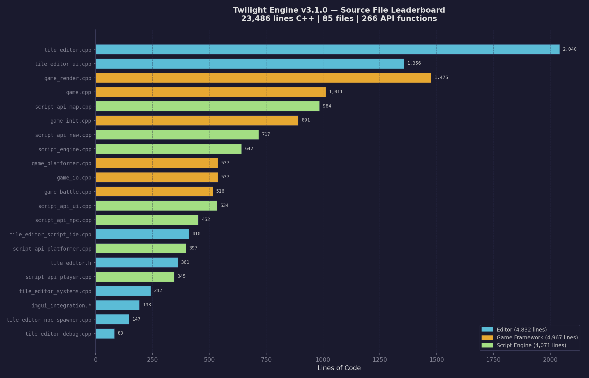

# Twilight Engine

A cross-platform Vulkan 2D RPG engine built in C++20, designed for creating EarthBound-style pixel art games. Ships with an integrated tile editor and SageLang scripting.

## Features

- **Vulkan Renderer** — Sprite batching, Y-sorted rendering, texture atlases, animated tiles
- **Cross-Platform** — Linux, Windows (cross-compile), Android (landscape, touch controls)
- **Tile Map System** — Multi-layer maps, collision, portals, animated water/grass overlays
- **Battle System** — Turn-based combat with rolling HP, party members, attack animations
- **Inventory System** — SageLang-driven items with battle submenu, elemental weaknesses, stacking
- **H.U.N.T.E.R. Skills** — Fallout S.P.E.C.I.A.L.-style character stats (Hardiness, Unholiness, Nerve, Tactics, Exorcism, Riflery)
- **Audio System** — miniaudio-powered BGM with crossfade, SFX, per-platform backends
- **Dialogue System** — Typewriter text, character portraits, branching conversations
- **NPC AI** — Idle wandering, hostile aggro/chase, auto-trigger encounters
- **Tile Editor** — Dear ImGui-powered editor with tabbed asset panels, undo/redo, zoom, file dialogs
- **SageLang Scripting** — Embedded scripting for dialogue, events, and game logic
- **Party System** — EarthBound-style follower trail with smooth interpolation

## First Game: Supernatural RPG

A fan project based on the Supernatural TV show with pixel art graphics. Play as Dean Winchester with Sam as a party follower. Features Bobby, Azazel, Vampires, and monster hunting.

## Build

```bash
# Prerequisites: Vulkan SDK, CMake 3.20+, C++20 compiler

# Linux
./build.sh linux

# Windows (cross-compile with MinGW)
./build.sh win64

# Android (requires Android SDK/NDK)
./build.sh android

# All platforms
./build.sh all

# Clean
./build.sh clean
```

## Controls

| Input | Action |
|-------|--------|
| WASD / Arrows | Move |
| Shift | Run |
| Z / Enter | Talk / Confirm |
| Tab | Toggle Editor |
| ESC | Quit |

## Project Structure

```
src/
  engine/          # Core engine (graphics, platform, resource, scripting)
  game/            # Game logic (overworld, dialogue, shared game state)
  editor/          # Tile editor (ImGui UI, tools, panels)
  third_party/     # stb_image, stb_truetype, imgui, sagelang
assets/
  textures/        # Tilesets, sprites, portraits
  fonts/           # TTF fonts
  maps/            # JSON map files
  scripts/         # SageLang dialogue scripts
  dialogue/        # Legacy dialogue files
shaders/           # GLSL vertex/fragment shaders
android/           # Android build (Gradle, manifest, native glue)
```

## Tech Stack

- C++20, Vulkan, GLFW, GLM, stb_image, stb_truetype
- Dear ImGui (editor UI)
- SageLang (scripting)
- tinyfiledialogs (native file dialogs)



## License

MIT
